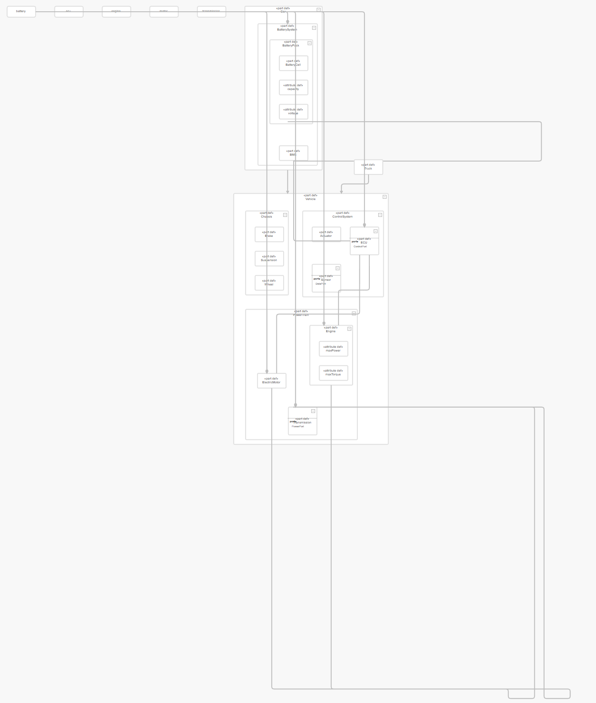

# SELab Block Editor (fork 원본 과제 README)

> **이 파일**은 SELab upstream 과제 안내 **원문**입니다.  
> fork 후 개선 요약·제출 데모는 루트 **[README.md](README.md)** 를 보세요.

---

# SELab Block Editor

## 프로젝트 개요

SELab Block Editor는 VS Code 확장(Extension)으로 동작하는 **블록 다이어그램 뷰어**입니다.
SysML v2의 블록 정의(BDD) 스타일 구조 다이어그램을 JSON 데이터 기반으로 렌더링합니다.

이 프로젝트는 **SELab의 개발자 선발을 위한 미니 프로젝트(Mini-Project)**입니다.
지원자는 아래 명시된 핵심 과제를 수행하고 그 결과물을 제출합니다.

> **제출 기한: 과제 수령 후 7일 이내**
> 단, 조기 제출할수록 좋은 평가를 받습니다. 빠른 완성도와 품질을 동시에 보여주세요.

---

## 핵심 과제: Edge Orthogonal 정렬 개선

### 목표

`tests/` 폴더에 있는 테스트 JSON 파일(`test-1.json` 등)을 블록 에디터에서 렌더링할 때,
**엣지(Edge)의 직교(Orthogonal) 라우팅 품질을 최대한 높이는 것**이 본 과제의 핵심 목표입니다.

직교 정렬이란 모든 엣지가 수평선(─) 또는 수직선(│) 세그먼트로만 구성되도록 경로를 잡는 라우팅 방식입니다.
단순히 직각으로 꺾는 것에 그치지 않고, 아래의 품질 기준을 동시에 만족해야 합니다.

### 직교 정렬 품질 기준

| 기준 | 설명 |
| --- | --- |
| **선 교차 최소화** | 엣지끼리 교차하는 횟수를 최소화합니다. 교차가 많으면 다이어그램의 가독성이 크게 떨어집니다. |
| **노드 겹침 없음** | 어떤 노드도 다른 노드 위에 겹쳐서 배치되지 않아야 합니다. |
| **엣지-노드 중첩 없음** | 엣지가 관계 없는 노드 위를 통과하지 않아야 합니다. |
| **엣지 경로 단순성** | 엣지의 꺾임(bend) 횟수를 불필요하게 늘리지 않습니다. 가능한 최단 경로를 유지합니다. |
| **균일한 간격** | 노드 간 간격이 균일하게 유지되어 시각적으로 안정적인 레이아웃을 구성합니다. |
| **계층적 배치** | 상속(specialization), 포함(containment) 관계가 계층 구조를 시각적으로 명확히 드러내도록 배치됩니다. |
| **엣지 종단 명확성** | 엣지의 시작점과 끝점이 노드 경계에 명확히 연결되어야 합니다. |
| **대칭성** | 같은 부모를 공유하는 자식 노드들은 가능한 한 대칭적으로 배치합니다. |

### 테스트 데이터 구조 (`tests/test-1.json`)

테스트 파일은 차량 시스템을 모델링한 노드와 엣지로 구성됩니다.

**노드 종류 (`kind`)**

- `partdefinition` — 부품 정의 (예: `Vehicle`, `Engine`, `Chassis`)
- `partusage` — 부품 사용 인스턴스 (예: `engine_p`, `motor_p`)
- `portdefinition` — 포트 정의 (예: `PowerPort`, `ControlPort`)
- `attributedefinition` — 속성 정의 (예: `maxPower`, `voltage`)

**엣지 종류 (`kind`)**

- `specialization` — 상속 관계 (예: `Car → Vehicle`)
- `containment` — 포함/구성 관계 (예: `Vehicle → PowerTrain`)
- `featuretyping` — 피처 타이핑 (예: `engine_p → Engine`)
- `association` — 연관 관계 (예: `ECU → Engine`)

---

## 프로젝트 구조

```text
block-editor/
├── src/                    # VS Code 확장 소스
│   ├── extension.js        # 확장 진입점, 커맨드 등록
│   ├── BlockDiagramPanel.js# 웹뷰 패널 생성 및 JSON 로딩
│   └── panel/
│       ├── LanguageServerBridge.js  # JSON 파일 로더
│       ├── BlockModelBuilder.js     # 모델 전처리
│       └── PanelMessageHandler.js   # 웹뷰 메시지 처리
├── media/
│   └── editor/             # 웹뷰 렌더링 스크립트
│       ├── boot.js         # 툴바 초기화, 레이아웃 부팅
│       ├── layout/
│       │   └── elkLayout.js        # ELK 기반 자동 레이아웃
│       └── mxgraph/        # mxGraph 기반 렌더링
├── packages/
│   └── selab-ui/           # 공유 UI 컴포넌트 (toolbar 등)
├── tests/
│   └── test-1.json         # 차량 시스템 테스트 데이터
└── scripts/
    └── build.mjs           # esbuild 빌드 스크립트
```

---

## 사용 방법

### 1. 설치 및 빌드

```bash
npm install
npm run build
```

### 2. 실행

VS Code에서 `F5` → **Extension Development Host** 창이 열립니다.

### 3. 다이어그램 열기

1. `tests/test-1.json` 파일을 VS Code에서 엽니다.
2. 우클릭 → **블록 다이어그램 옆에 열기** 선택
3. 또는 명령 팔레트(`Ctrl+Shift+P`) → `Open Block Diagram Beside`

### 4. 입력 JSON 포맷

```json
{
  "nodes": [
    { "id": "Vehicle", "kind": "partdefinition", "name": "Vehicle" }
  ],
  "edges": [
    { "source": "Car", "target": "Vehicle", "kind": "specialization" }
  ]
}
```

---

## 현재 상태 (As-Is)

아래 이미지는 `test-1.json`을 **fork 당시 baseline** 구현으로 렌더링한 결과입니다.



**현재 문제점:**

- 노드들이 계층 구조를 무시하고 세로로 길게 중첩되어 배치됨
- 일부 노드가 캔버스 영역 밖으로 벗어남
- 엣지가 무관한 노드 위를 통과하며 교차가 매우 많이 발생
- `Car`, `Truck`, `Engine`, `Actuator` 등 일부 노드가 화면 상단에 레이아웃에서 분리된 채로 떠 있음
- 전체적인 계층 구조(Vehicle → PowerTrain → Engine 등)가 시각적으로 전혀 드러나지 않음

**과제의 목표는 이 상태를 개선하는 것입니다.**

---

## 평가 기준

지원자는 `tests/*.json`을 렌더링했을 때의 다이어그램 레이아웃 품질로 평가됩니다.
