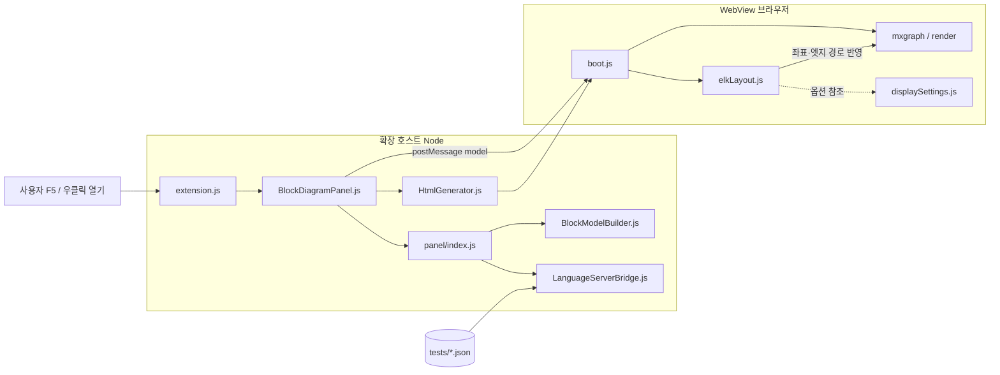
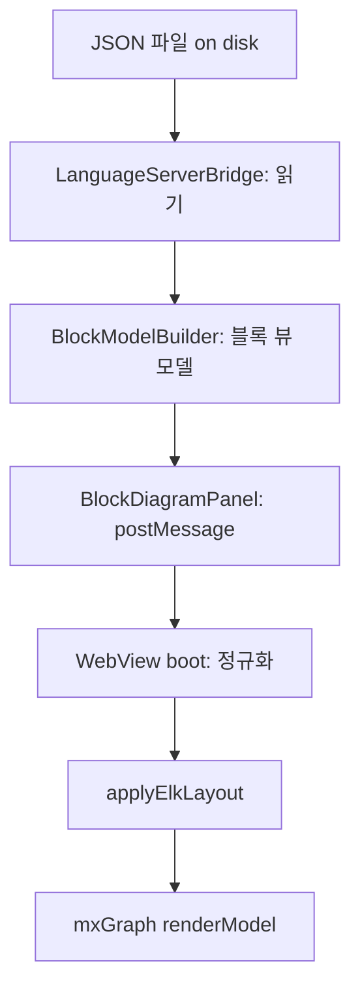

# SELab Block Editor — 간단 지도

VS Code 확장이 JSON을 읽어 WebView에서 **ELK(배치·직교 라우팅) + mxGraph(그리기)**로 블록 다이어그램을 보여 주는 구조입니다.

---

## 디렉터리 한눈에

| 경로 | 역할 |
| --- | --- |
| `src/extension.js` | 커맨드 등록, 확장 활성화 |
| `src/BlockDiagramPanel.js` | WebView 패널, JSON 기준 모델 로드·`postMessage` |
| `src/HtmlGenerator.js` | WebView HTML 조립 (`media`·번들 URI) |
| `src/panel/index.js` | `fetchBlockModel` = 로드 + `buildBlockModel` |
| `src/panel/LanguageServerBridge.js` | 다이어그램 JSON 로드 |
| `src/panel/BlockModelBuilder.js` | 블록 뷰용 노드/엣지 필터·정규화 |
| `src/panel/PanelMessageHandler.js` | WebView ↔ 확장 메시지 처리 |
| `dist/extension.js` | esbuild 출력 — 실제 로드되는 확장 진입점 |
| `media/editor/boot.js` | WebView 부트, ELK 적용, mxGraph 렌더 연동 |
| `media/editor/layout/elkLayout.js` | ELK 그래프·옵션·레이아웃 |
| `media/editor/config/displaySettings.js` | ELK·간격·노드 크기 등 설정 집약 |
| `media/editor/mxgraph/` | mxGraph 래퍼·셀 팩토리 등 |
| `packages/selab-ui/` | 툴바·공통 UI (로컬 패키지) |
| `tests/*.json` | 렌더링용 픽스처 데이터 |
| `scripts/build.mjs` | `src/extension.js` → `dist` 번들 |

---

## 데이터 흐름도

### 상세 (컴포넌트 단위)

### 단계 요약 (순서만)

---

## 빌드·실행 한 줄

1. `npm install` → `npm run build` (`dist/extension.js` 생성)  
2. VS Code에서 **F5** → Extension Development Host  
3. `tests/test-1.json` 열기 → **블록 다이어그램 옆에 열기**

---

## 과제 작업 시 보통 손대는 곳

레이아웃·직교 엣지 품질: **`media/editor/layout/elkLayout.js`**, **`media/editor/config/displaySettings.js`**, **`media/editor/boot.js`**, **`media/editor/mxgraph/`**  
모델에 무엇이 들어가는지: **`src/panel/BlockModelBuilder.js`**
