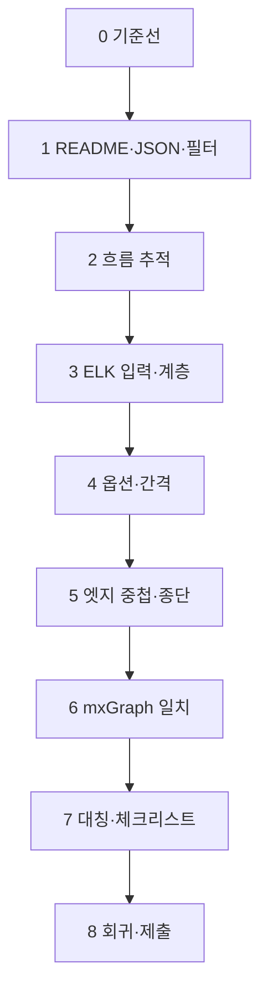

# SELab Block Editor — 과제 해결 플랜 (작업 순서)

> **근거 문서(최우선):** 저장소 루트 `README.md`  
> **보조:** `p_docs/00_프로젝트_초기_분석_보고서.md`, `work-log.md`  
> **1차 마무리:** `p_docs/07_마무리_및_알려진_한계.md` (다중 부모 자식 UI **해결 불가·보류**)  
> README에 없는 목표·범위는 잡지 않는다. 충돌 시 README를 따른다.

---

## 1. 과제 한 줄 정리 (README 기준)

- **입력:** `tests/`의 JSON(`test-1.json` 등)을 블록 에디터에서 연다.
- **목표:** 렌더링 시 **엣지 직교(Orthogonal) 라우팅 품질**을 최대한 높인다.
- **평가:** `tests/*.json`을 렌더했을 때의 **다이어그램 레이아웃 품질**(시각적 결과).

README의 **직교 정렬 품질 기준** 8항목(교차 최소화, 노드 겹침 없음, 엣지-노드 비중첩, 경로 단순성, 균일 간격, 계층적 배치, 엣지 종단 명확성, 대칭성)은 아래 각 단계 끝날 때마다 **체크리스트**로 스스로 점검한다.

---

## 2. As-Is에서 벗어나야 할 것 (README 명시)

다음이 개선 대상이다 (`docs/image.png` 및 README 본문).

- 계층 무시·세로로 길게 중첩
- 일부 노드 캔버스 밖
- 엣지가 무관 노드 위 통과·교차 과다
- 일부 노드가 상단에 분리되어 떠 있음
- Vehicle → PowerTrain → Engine 등 **계층이 시각적으로 드러나지 않음**

---

## 3. 전체 전략 (초기 분석 보고서와 정합)

| 순서 개념 | 내용 |
| --- | --- |
| 1 | 기준선·검증 방법 고정 (`test-1` 중심) |
| 2 | **ELK 입력 그래프**가 README의 containment / specialization 의미와 맞는지 정합 |
| 3 | **ELK 옵션·간격**(`displaySettings.js`)을 단계적으로 조정 |
| 4 | **엣지-노드 중첩·교차**가 남으면 spacing·제약·후순위 기법 검토 |
| 5 | **mxGraph**가 ELK 기하를 왜곡 없이 쓰는지 확인 |
| 6 | `test-2`~`test-10` 등으로 회귀·과적합 방지 후 제출 |

---

## 4. 작업 순서 (단계별)

아래는 **실행 순서**다. 단계를 건너뛰지 말고, 각 단계 끝에 “검증”을 통과한 뒤 다음으로 넘어간다.

### 단계 0 — 환경·기준선 고정

| # | 작업 | 산출 |
| --- | --- | --- |
| 0-1 | `npm install` → `npm run build` | `dist/extension.js` 최신 |
| 0-2 | F5 → Extension Development Host → `tests/test-1.json` → **블록 다이어그램 옆에 열기** | 동작 확인 |
| 0-3 | **변경 전** As-Is 스크린샷 1장 보관(선택이 아니라 권장) | 회귀 비교용 |
| 0-4 | WebView 개발자 도구 콘솔 열기 | ELK 실패·`fallbackGrid` 로그 여부 확인 |

**검증:** README “사용 방법”과 동일하게 다이어그램이 열린다.

---

### 단계 1 — README·데이터 이해 (코드 수정 없음 또는 최소)

| # | 작업 | 산출 |
| --- | --- | --- |
| 1-1 | `README.md` 품질 기준 표 + 테스트 데이터 `kind` 목록 숙지 | 체크리스트 복사해 두기 |
| 1-2 | `tests/test-1.json`에서 containment / specialization / featuretyping / association 분포 파악 | 메모 또는 간단 표 |
| 1-3 | `src/panel/BlockModelBuilder.js`로 **화면에 들어가는** 노드·엣지 범위 확인 | “JSON에만 있고 안 보이는” 착시 방지 |

**검증:** README에 나온 엣지·노드 종류가 테스트 JSON과 대응되는지 설명할 수 있다.

---

### 단계 2 — 데이터 흐름 추적 (읽기 위주)

| # | 작업 | 산출 |
| --- | --- | --- |
| 2-1 | `src/panel/index.js` → `fetchDiagramModel` → `buildBlockModel` 흐름 정리 | 한 페이지 이내 메모 |
| 2-2 | `media/editor/boot.js`에서 모델 수신 후 **`applyElkLayout`** 호출 지점·`renderModel` 연결 확인 | “ELK 전/후” 위치 표시 |
| 2-3 | `media/editor/layout/elkLayout.js`에서 **그래프 빌드**(노드·엣지·parent) 진입점 찾기 | 함수/블록 이름 메모 |

**검증:** “JSON → 필터 → WebView 정규화 → ELK → mxGraph” 순서를 말로 설명 가능.

---

### 단계 3 — ELK 입력 정합성 (README **계층적 배치** 우선)

| # | 작업 | 산출 |
| --- | --- | --- |
| 3-1 | `elkLayout.js`의 **계층 엣지 판별**(`isHierarchicalEdgeKind` 등)과 실제 JSON `kind` 문자열 일치 여부 점검 | 불일치 시 수정 후보 목록 |
| 3-2 | containment가 **ELK children(중첩 노드)**으로 반영되는지, 아니면 평면 그래프+엣지만인지 확인 | README 목표에 맞게 설계 결정 |
| 3-3 | specialization이 계층(또는 별도 레이어)에 반영되는 방식 확인 | 필요 시 매핑 수정 |

**검증 (시각):** Vehicle → PowerTrain → Engine 등 **포함·상속 계열**이 한눈에 구분된다(README 목표 문구에 가깝게).

**검증 (콘솔):** ELK 오류 없이 동작하는지, 의도치 않게 `fallbackGrid`만 쓰이지 않는지.

---

### 단계 4 — ELK 옵션·간격 (README **균일 간격**·교차·겹침)

| # | 작업 | 산출 |
| --- | --- | --- |
| 4-1 | `media/editor/config/displaySettings.js`의 **`elk` 블록**을 표로 옮겨 적기(현재값 스냅샷) | 튜닝 전 기록 |
| 4-2 | 한 번에 하나의 축만 조정(예: 층 간 간격 → 교차 관련 → 컴팩션) | 변경 로그(날짜·값·스샷) |
| 4-3 | `nodePrecompute`·container 패딩 등 **노드 크기와 spacing 불일치** 여부 점검 | 겹침·캔버스 이탈 완화 |

**검증:** README 기준 중 **노드 겹침 없음**, **균일한 간격**, **선 교차 최소화** 방향으로 이전 단계(0-3 스샷)와 비교.

---

### 단계 5 — 엣지 품질 (README **엣지-노드 중첩 없음**·경로 단순성·종단)

| # | 작업 | 산출 |
| --- | --- | --- |
| 5-1 | `elk.spacing.edgeNode`, `edgeEdge`, 직교 라우팅 관련 옵션으로 무관 노드 관통 완화 시도 | 4-2와 같은 로그에 추가 |
| 5-2 | 한계 시 ELK **제약·포트·장애물** 등 고급 옵션 조사(README 범위 내에서만 적용) | 적용 여부와 이유 메모 |
| 5-3 | 필요 시 `media/editor/render/drawEdge.js`와 엣지 생성 경로에서 **앵커/종단** 확인 | 종단 명확성 개선 |

**검증:** 무관 노드 위 통과·불필요한 꺾임이 줄었는지 `test-1`로 확인.

---

### 단계 6 — mxGraph 기하 일치 (README와 보고서 6.5)

| # | 작업 | 산출 |
| --- | --- | --- |
| 6-1 | ELK가 준 경로(bendpoints/sections 등)가 **mxGraph** 셀에 그대로 반영되는지 `media/editor/mxgraph/` 관련 코드 추적 | 불일치 지점이면 수정 이슈로 기록 |
| 6-2 | 컨테이너 헤더·좌표 스케일로 인한 “가짜 관통” 여부 확인 | displaySettings와 연계 |

**검증:** 동일 ELK 출력에 대해 화면상 엣지가 의도와 어긋나지 않음.

---

### 단계 7 — 형제 대칭·기타 기준 마무리

| # | 작업 | 산출 |
| --- | --- | --- |
| 7-1 | 같은 부모 자식 노드 **대칭성** README 기준 점검 | ELK nodePlacement·order 관련 옵션 실험(로그 유지) |
| 7-2 | README 8항목 체크리스트 전부 한 번씩 표시 | 체크/미달 사유 |

**검증:** `test-1`에서 미달 항목이 있으면 단계 3~6 중 어디를 다시 조정할지 결정.

---

### 단계 8 — 회귀·제출 준비 (README 평가 기준)

| # | 작업 | 산출 |
| --- | --- | --- |
| 8-1 | `test-2.json` ~ `test-10.json` 중 최소 1~2개 추가로 열어 레이아웃 붕괴 없는지 확인 | README “`tests/*.json`” 평가 대비 |
| 8-2 | 최종 스크린샷·짧은 변경 요약(무엇을 왜 바꿨는지) | 제출·발표용 |
| 8-3 | `npm run build` 재실행 후 제출물에 `dist` 포함 여부·과제 안내에 맞게 패키징 | 과제 지침 따름 |

**검증:** README 평가 문구(“`tests/*.json`을 렌더링했을 때의 다이어그램 레이아웃 품질”)에 스스로 답할 수 있다.

---

## 5. 단계 의존 관계 (요약 다이어그램)

---

## 6. 리마인더 (초기 분석 보고서 반영)

- ELK가 안 뜨고 **`fallbackGrid`**만 타면 README 수준의 개선이 어렵다 → 콘솔로 먼저 확인.
- `BlockModelBuilder` 밖 `kind`는 화면에 없을 수 있다 → 디버깅 시 JSON과 화면을 분리해서 보지 않기.
- `media/editor`는 **IIFE·`window.SELAB`** 패턴이므로 새 코드도 동일 스타일을 유지하는 편이 안전하다.

---

## 8. 2026-05-20 마무리 (1차)

README 8항목 **전부 만족**을 목표로 한 **광범위 레이아웃 실험은 중단**하고, 회귀가 적은 축만 반영했다.

| 단계 | 마무리 시점 |
|------|-------------|
| 0~2 | 기준선·흐름 이해 — 완료 |
| 3~4 | ELK·`bddLayout`·`layout.js` precompute — **부분** (test-1·test-9 중심) |
| 5~6 | spec `specEdgeRouter` + `MxEdgeBuilder` + 하이라이트 — **부분** |
| 7~8 | 대칭·전 테스트 — **스모크만** (test-8 다중 spec 등 **미해결**) |

### 해결 불가로 문서화만 한 항목

**여러 부모를 가진 자식 노드 UI** (다중 containment `__in__` 복제의 화면 배치, test-8 `Gateway` 다중 spec 부모마다 복제·아래 배치 등) — `p_docs/07_마무리_및_알려진_한계.md` §2.

### 제출 전 체크 (최소)

- [ ] F5 test-1 README As-Is 대비 개선 스샷
- [ ] F5 test-9 `SCADA` 🔼·상속선 없음
- [ ] `npm run build` · `node scripts/check-bdd-postlayout.mjs` (있을 때)

---

## 9. 문서 이력

| 날짜 | 내용 |
| --- | --- |
| 2026-05-14 | `README.md` 및 `p_docs/00_프로젝트_초기_분석_보고서.md` 기준 초안 작성 |
| 2026-05-20 | 마무리 스냅샷·다중 부모 UI 보류 — `07_마무리_및_알려진_한계.md`, `p_docs` 전반 갱신 |
